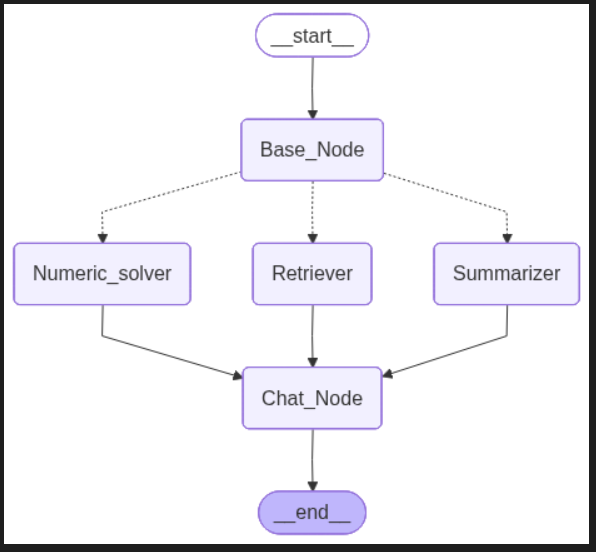
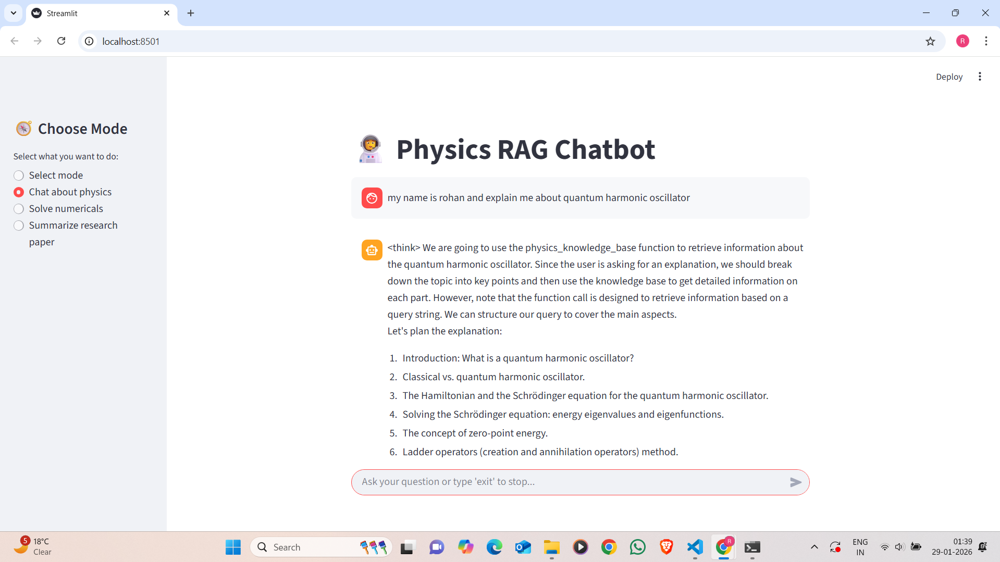

# 🧠 Physics RAG Chatbot using LangGraph & Local LLM

A physics-focused Retrieval-Augmented Generation (RAG) chatbot built using **LangGraph**, **LangChain**, **FAISS**, and **Open Source LLMs**.  
The system supports conversational physics queries, numerical problem solving, and research paper summarization through a structured graph-based workflow.

---

## 🚀 Features

- 🔍 **Physics-aware RAG** using FAISS vector database  
- 🧠 **Graph-based reasoning pipeline** using LangGraph  
- 💬 **Conversational physics chat**
- ✏️ **Step-by-step numerical problem solving**
- 📄 **Research paper summarization (PDF input)**
- 🧩 **Intent-based routing** (chat / numericals / summarization)
- 🖥️ **Interactive Streamlit UI**
- 🔒 **Local LLM inference** (no external API calls)

---

## 🏗️ System Architecture

The application is orchestrated using a **LangGraph state machine**, where the user query is routed based on intent.

### 🔁 Graph Flow
- User input → Base Node  
- Conditional routing:
  - Physics chat → Retriever
  - Numerical problems → Solver
  - Research paper → Summarizer  
- Final response → Chat node → UI

📌 **Graph structure:**




## 🖥️ User Interface

The frontend is built using **Streamlit**, allowing users to:

- Select the task mode from the sidebar
- Chat naturally about physics concepts
- Solve numericals step-by-step
- Upload PDFs for summarization

📌 **Example UI views:**

### Physics Chat


### Numerical Solver


### Research Paper Summarization


---

## 📂 Repository Structure

```text
.
├── app_1.py                    # Main Streamlit + LangGraph application
├── RAG_data_ingestion.ipynb    # Data ingestion and FAISS index creation
├── retrival_logic.ipynb        # Retrieval and RAG experimentation
├── README.md
├── Old version/                # Archived experimental code
